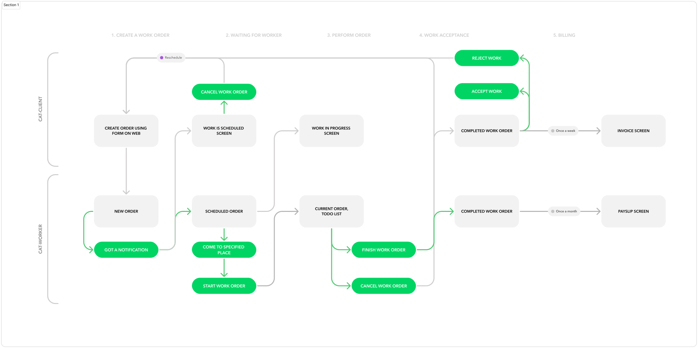
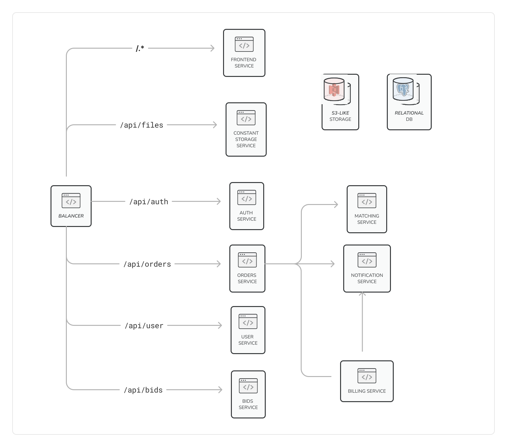

# Make cats free again

Before I brought you to the system design lets cover up some details on what we are going to build.

## The product

We need to create the platform which will allow cats to hire workers to perform their chores.

### Cat client user flow

1. Post a work order with all details by using our platform
1. Wait for worker being assigned to a work order
1. Receive a notification that asignee is found and a work order is scheduled
1. Wait until job is done
1. Considers a report of completed work
1. Accept or reject a order
1. Pay for all orders once a week

### Cat worker user flow

1. Pass testing to become a worker
1. Wait for an order
1. Receive a notification that work is found and scheduled
1. Come to specified place and perform a work
1. Provide report with before/after photos
1. Wait for a approval or rejection
1. Receive money for orders (or pay a fine) once a month

Please consider this simplified work order flow

### Administrator flow

- edit on order parameters in admin panel
- randomly check an order to ensure quality
- call the client to ask a feedback
- investigate failed/cancelled orders
- reward workers

## Requirements

I am not allowed to share them to you, sorry for that 😢

## Random observations

- Service is small,

## Architecture

We will use _modular monolith_ architecture for creating this platform. Thus it will be easy to start and in case of growth we will be able to gradually switch to microservice architecture.

Why don't we use microservices at the beginning?
- _No scaling issues_. Service load is really small, we can easyly grow 100x times and still live with monolith here 😮
- _Service is small_. There won't be problem to deploy it, and in case if there will – we can move it to microservice
- _Big overhead_. Microservices are commonly used to create large-scale and complicated services. They comes with a lot of issues to handle, lets defer this solution for a while.
- _Don't start with services with distributed transactions_, the platform might be closed in a couple of months its more important too start 

### Components
Lets start with high-level overview of components

- **Balancer**  
  Whe can be attacked from our competitors, so it is nice to have a good cloud balancer that able to:
  - save us from DDoS attack
  - effectively balance traffic
  - do for us routing and ssl termination
  - notify us if one of our services returned 500 because they are down

- **Frontend service**  
  frontend service implements screens for the end users (clients, workers and managers).
  - Depends on team expirience we can use Next.JS/Remix/Plain React or other solutions.
  - Different roles should be implemented in different applications
  - Use a monorepo to effectively share code (i.e. design system) between applications

- **Auth service**  
  service that covers all logic about:
  - authorization & authentication to platform (identity managment)
  - providing SSO integrations to service (google, twitter, facebook, any SAML or OpenID service)
  - use ready solution (keykloak or cloud solution if possible)
  
- **User service**  
  service that covers all logic about user:
  - CRUD user (profile) operations
  - GDPR - complience features if needed
   
- **Orders service**  
  API service that implement logic of working with orders (CRUD) with statuses
  - crud order
  - list orders for a specific period of time
  - creates payslip/invoice

- **Billing service**  
  API service that implement logic of payments
  - should be easy to add new payment system

- **Bids service**  
  Allows to make a bid for a specific order for managers (administrators)
  - create bids
  - calculate winner
  - change winner/losers balances

- **Matching service**  
  Matches workers to orders
  
- **Notification service**  
  Abstraction over notification
  - from the beginning should work with email (mailchimp)

- **S3-like storage**  
  Needed for images, file attachments like photos, etc

- **Relational DB storage**  
  We can start with managed Postgres
  

### Models
TBD

### Low level overview
TBD