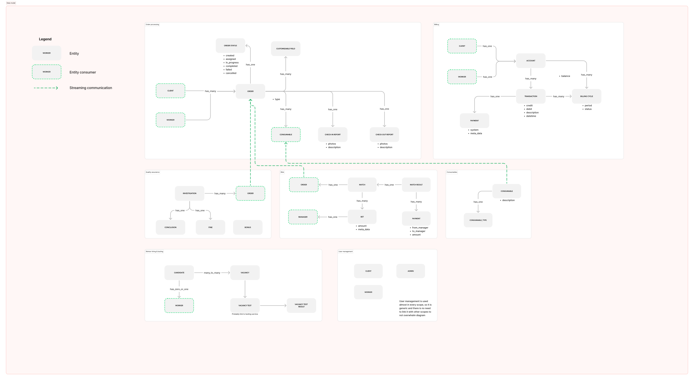
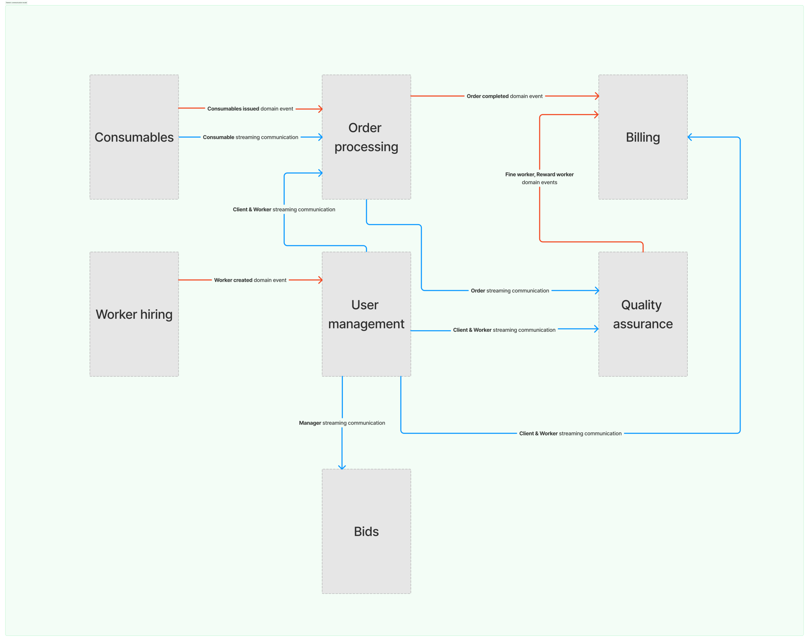

# Make cats free again

Before I brought you to the system design lets cover up some details on what we are going to build.

## The product

We need to create the platform which will allow cats to hire workers to perform their chores.

### Cat client user flow

1. Post a work order with all details by using our platform
1. Wait for worker being assigned to a work order
1. Receive a notification that asignee is found and a work order is scheduled
1. Wait until job is done
1. Considers a report of completed work
1. Accept or reject a order
1. Pay for all orders once a week

### Cat worker user flow

1. Pass testing to become a worker
1. Wait for an order
1. Receive a notification that work is found and scheduled
1. Come to specified place and perform a work
1. Provide report with before/after photos
1. Wait for a approval or rejection
1. Receive money for orders (or pay a fine) once a month

### Administrator flow

- edit on order parameters in admin panel
- randomly check an order to ensure quality
- call the client to ask a feedback
- investigate failed/cancelled orders
- reward workers
- fine workers

## Requirements

[Requirements details are in separate file](./requirements.md)

## Event storming diagram

- Bids are in separate context because it is not critical feature, it is important to be sure that is not affects critical services
- We have one generic service – user management, it contains all users with their roles, in future it can work with SSO and authN & authz
- consumables look like separate space because it already has a call to external service and probably we will be able to skip this stage

## Architecture

### Data model diagram

### Generic communication model

We will use _modular monolith_ architecture for creating this platform. Thus it will be easy to start and in case of growth we will be able to gradually switch to microservice architecture.
_How it should be implemented?_

- System is divided into parts – scopes (modules)
- Each module is developed independently
- You can add dependency on from one module to another
- Circular dependencies are forbidden
- Module has public api that other modules can call, you cannot call private API
- Public api called by synchronous call inside a module

_Why don't we use microservices at the beginning?_

- _No scaling issues_. Service load is really small, we can easyly grow 100x times and still live with monolith here 😮
- _Service is small_. There won't be problem to deploy it, and in case if there will – we can move it to microservice
- _Big overhead_. Microservices are commonly used to create large-scale and complicated services. They comes with a lot of issues to handle, lets defer this solution for a while.
- _Don't start with services with distributed transactions_, the platform might be closed in a couple of months its more important to start earlier

_Which language should the team use?_

- Better to choose mature backend technologies to scale easily. For example Java, Kotlin, C#, Go, Python.
- It is dependent on a team, you can got me a call and we will discuss it

### Kind of communications

Lets stick with synchronous communication for now. The key focus is to have good isolation between system modules. Looks like this is enough on this stage, if we will grow we can change our opinion and start refactoring.

### Components

Brief high-level overview of proposed modules

- **Balancer**  
  Whe can be attacked from our competitors, so it is nice to have a good cloud balancer that able to:

  - save us from DDoS attack
  - effectively balance traffic
  - do for us routing and ssl termination
  - notify us if one of our services returned 500 because they are down

- **Frontend service**  
  frontend service implements screens for the end users (clients, workers and managers).

  - Depends on team expirience we can use Next.JS/Remix/Plain React or other solutions.
  - Different roles should be implemented in different applications
  - Use a monorepo to effectively share code (i.e. design system) between applications

- **Auth service**  
  service that covers all logic about:

  - authorization & authentication to platform (identity managment)
  - providing SSO integrations to service (google, twitter, facebook, any SAML or OpenID service)
  - use ready solution (keykloak or cloud solution if possible)

  - ? maybe merge with user service?

- **User service**  
  service that covers all logic about user:

  - CRUD user (profile) operations
  - GDPR - complience features if needed
  - User types – worker, client and manager

- **Orders service**  
  API service that implement logic of working with orders (CRUD) with statuses

  - crud order
  - list orders for a specific period of time
  - creates payslip/invoice

- **Billing service**  
  API service that implement logic of payments

  - should be easy to add new payment system

- **Worker hiring service**  
  API service that implements flow of hiring workers

  - used admins to hire acquire new worker to the system.

- **Quality assurance service**  
  API service that implements related to quality

  - used by admins to investigate cases in fine workers

- **Bids service**  
  Allows to make a bid for a specific order for managers (administrators)

  - create bids
  - calculate winner

- **Matching service**  
  Matches workers to orders
- **Notification service**  
  Abstraction over notification

  - from the beginning should work with email (mailchimp)

- **S3-like storage**  
  Needed for images, file attachments like photos, etc

- **Relational DB storage**  
  We can start with managed Postgres
