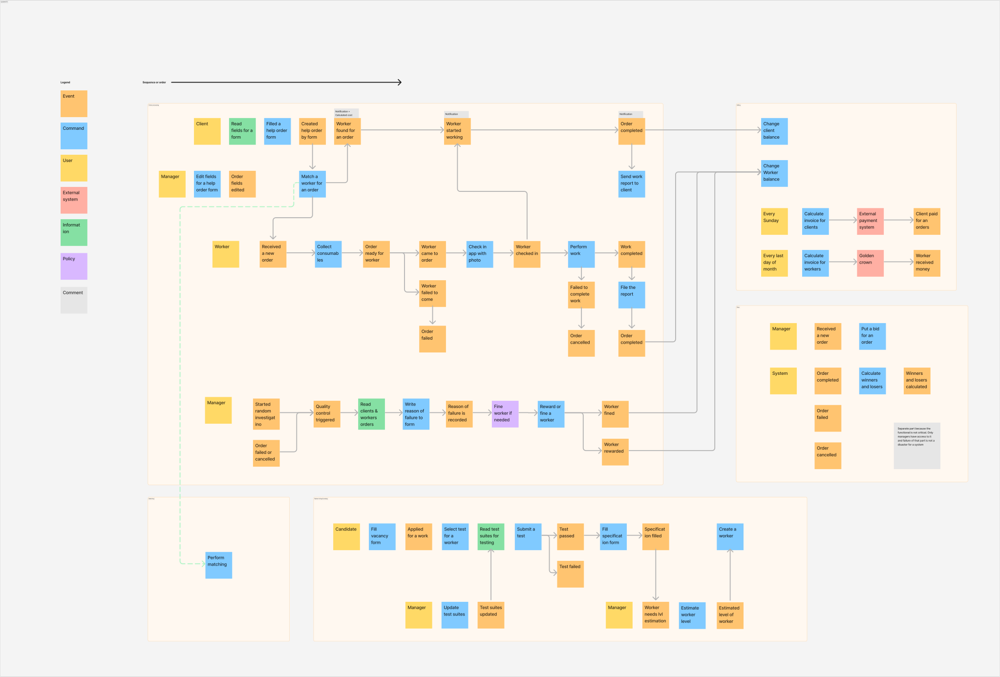

# Lesson 2

This time we will describe system from DDD perspective.

## Subdomains

Generic domains will be outsourced. Supporing and Core domains will be maintained by us.

## Core domain chart

## Bounded contexts from domains

## Bounded contexts from ES

## Why bounded contexts from domains and ES differ?

1. Matching is complicated part of our business that differs us from other, so it need special handling. We moved it to separate domain
2. Quality assurance is closely related to how orders work and structured. It is logical to develop in one team because otherwise they will compete
3. Consumables are also closely related to orders.

This is happended because in ES model we don't think about domain parts and their importance for our business. We think about business commands.

## Updated ES model

Order processing looks overwhelmed, but thats because it contains lot of technical details (I've deleted some but I am still in process of becoming business-minded)

## Updated data model

## Important architecture properties for the project

- Development cost and money are not important
  > Деньги на данный момент не критичны, happy cat box готовы потратить столько, сколько потребуется

- Low time to market
  > Updated (12/05): Бизнесу необходим высокий низкий ТТМ (Time To Market), чтобы конкурировать на рынке.

- We need not only high TTM but also high stability
  > Для бизнеса критично проверять новые гипотезы по отсеву котов и изменять уже существующие с максимальной скоростью и надёжностью.

## Architecture style

We need high TTM and stabilty, money are not important. Then we can afford microservices. They will give us to tune system for maximum stability and we will be able to change only parts we need to change.

This is how interaction between microservices will look

